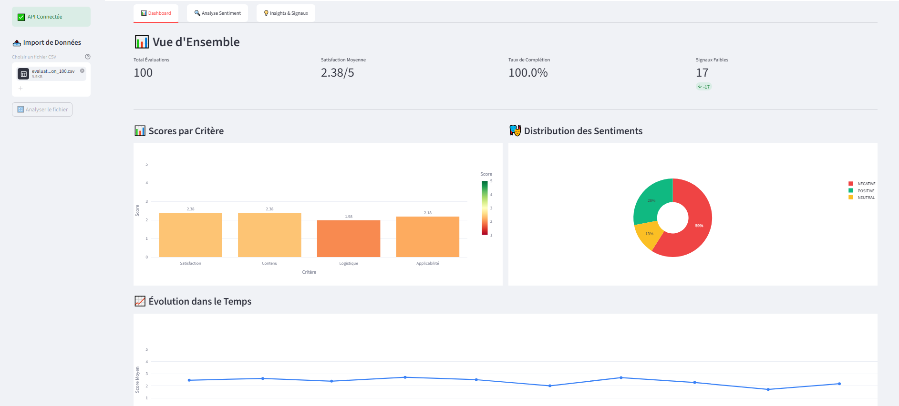

# Dashboard IA Analyse RH


A professional, end-to-end dashboard for HR analytics using AI and data science. This project features a Python backend and a Streamlit frontend for interactive data exploration, sentiment analysis, topic extraction, clustering, and KPI calculation.



## Demo Data

A sample HR analytics dataset is included for demo purposes:
[`backend/data/evaluation_formation_100.csv`](backend/data/evaluation_formation_100.csv)

## Features
- Sentiment analysis with BERT
- Topic extraction and clustering
- KPI calculation and monitoring
- Data anonymization and batch import
- Interactive Streamlit dashboard
- Dockerized backend and frontend

## Quick Start

### Backend
```bash
cd backend
python -m venv .venv  # if not already created
.\.venv\Scripts\activate  # Windows
pip install -r requirements.txt
python main.py
```

### Frontend
```bash
cd frontend
pip install -r requirements.txt
streamlit run streamlit_app.py
```

## Run with Docker

From the project root:

```bash
docker compose up --build -d
docker compose ps
```

Open:
- Frontend: `http://localhost:8501`
- Backend health: `http://localhost:8000/health`

Useful commands:

```bash
docker compose logs -f backend
docker compose logs -f frontend
docker compose down
```

## Folder Structure
- `backend/` — Python backend (APIs, models, services)
- `frontend/` — Streamlit frontend
- `code/` — Model cache and artifacts

## Requirements
- Python 3.8+
- pip
- Streamlit
- Docker (optional)

## License
MIT License (see LICENSE)

## Author
[hassanbem](https://github.com/hassanbem)

---

> This project is designed for HR analytics internships and showcases skills in Python, AI, and dashboard development.
